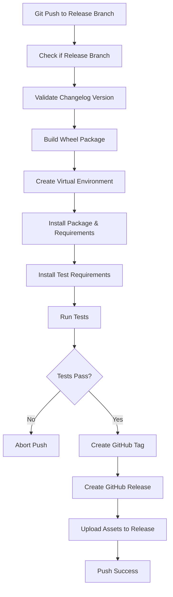

# Python Release Branch Pre-push Rules Plan

## 專案概述
為Python專案添加release分支的自動化部署流程，確保發布版本的品質和一致性。

## 目標
- 自動化release分支的品質檢查
- 確保版本號和changelog的同步
- 自動化測試和打包流程
- 自動化GitHub releases發布

## 詳細流程設計

### Pre-push檢查流程 (針對release分支)


### 檢查項目詳細說明

#### 1. 分支檢查 (Git Flow 標準)
- 檢測當前分支是否為標準 Git Flow release 分支
- **僅支援單一分支模式**: `release`
- **不再支援**: `release/*`, `releases/*` (避免多分支混亂)
- **符合團隊協作最佳實踐**: 單一 release 分支便於管理和合併

#### 2. Changelog版本檢查
- 解析CHANGELOG.md文件
- 驗證最新版本號是否更新
- 確保版本號符合語義化版本標準
- 檢查版本號與setup.py/pyproject.toml的一致性

#### 3. 構建和測試流程
- 使用setup.py或pyproject.toml構建wheel
- 創建全新的虛擬環境
- 安裝構建的wheel包
- 安裝production和test依賴
- 運行完整測試套件

#### 4. GitHub整合
- 創建版本標籤
- 創建GitHub Release
- 上傳以下資產：
  - wheel文件
  - CHANGELOG.md
  - README.md
  - 其他指定文件

## 實施計劃

### 階段1: 核心檢查機制
1. **分析Python專案的release分支部署需求**
   - 研究現有專案結構
   - 確定版本管理策略
   - 分析依賴管理模式

2. **設計release分支的pre-push檢查流程**
   - 創建分支檢測邏輯
   - 設計流程控制結構
   - 定義錯誤處理機制

3. **實作changelog版本檢查機制**
   - 解析CHANGELOG.md格式
   - 版本號驗證邏輯
   - 與專案配置的同步檢查

### 階段2: 構建和測試
4. **創建wheel構建腳本**
   - 支援setup.py和pyproject.toml
   - 構建過程驗證
   - 清理和錯誤處理

5. **實作虛擬環境創建和測試流程**
   - 自動虛擬環境管理
   - 依賴安裝流程
   - 測試執行和結果處理

### 階段3: GitHub整合
6. **整合GitHub API進行標籤和release創建**
   - GitHub API認證
   - 標籤創建邏輯
   - Release創建流程

7. **創建GitHub releases文件上傳腳本**
   - 文件上傳邏輯
   - 多文件批量處理
   - 上傳狀態驗證

### 階段4: 完善和測試
8. **編寫release流程文檔**
   - 使用指南
   - 配置說明
   - 故障排除

9. **測試完整的release流程**
   - 端到端測試
   - 錯誤場景測試
   - 性能優化

## 技術實現細節

### 文件結構
```
template_project/
├── .git-hooks/
│   ├── pre-push                    # 主要hook (已存在)
│   └── release-checks.sh           # release專用檢查
├── scripts/
│   ├── release/
│   │   ├── check-changelog.py      # changelog檢查
│   │   ├── build-wheel.sh          # wheel構建
│   │   ├── test-release.sh         # 測試流程
│   │   ├── github-release.sh       # GitHub release
│   │   └── upload-assets.sh        # 資產上傳
│   └── utils/
│       ├── version-utils.py        # 版本工具
│       └── github-api.py           # GitHub API包裝
├── config/
│   ├── release-config.yml          # release配置
│   └── github-config.yml           # GitHub配置
└── docs/
    └── release-guide.md            # release指南
```

### 配置文件格式

#### release-config.yml
```yaml
release:
  # 分支模式
  branch_patterns:
    - "release"
    - "release/*"
    - "releases/*"
    
  # 版本檢查
  version_check:
    changelog_file: "CHANGELOG.md"
    version_files:
      - "setup.py"
      - "pyproject.toml"
      - "src/package/__init__.py"
    
  # 構建設定
  build:
    output_dir: "dist"
    clean_before_build: true
    
  # 測試設定
  testing:
    venv_dir: ".release-test-env"
    test_command: "pytest"
    requirements_files:
      - "requirements.txt"
      - "requirements-test.txt"
      - "requirements-dev.txt"
    
  # GitHub設定
  github:
    create_tag: true
    create_release: true
    upload_assets:
      - "dist/*.whl"
      - "CHANGELOG.md"
      - "README.md"
```

### 主要腳本功能

#### 1. changelog檢查腳本
```python
# check-changelog.py
def check_changelog_version():
    """檢查changelog版本是否更新"""
    # 解析CHANGELOG.md
    # 獲取最新版本
    # 與setup.py對比
    # 驗證版本格式
    pass
```

#### 2. wheel構建腳本
```bash
# build-wheel.sh
#!/bin/bash
# 清理舊的構建
# 檢查setup.py或pyproject.toml
# 執行python -m build或python setup.py bdist_wheel
# 驗證構建結果
```

#### 3. 測試流程腳本
```bash
# test-release.sh
#!/bin/bash
# 創建虛擬環境
# 安裝wheel和依賴
# 運行測試
# 清理環境
```

#### 4. GitHub release腳本
```bash
# github-release.sh
#!/bin/bash
# 創建標籤
# 創建release
# 上傳文件
```

## 使用場景

### Git Flow 標準工作流程
1. **功能開發**: `feature/功能名` 分支開發完成
2. **整合到開發分支**: 合併到 `develop` 分支
3. **準備發布**: 從 `develop` 創建 `release` 分支
   ```bash
   git checkout develop
   git checkout -b release
   ```
4. **版本準備**: 在 `release` 分支更新版本號和 CHANGELOG.md
5. **觸發自動檢查**: 執行 `git push origin release`
6. **自動化流程**: 自動觸發 pre-push 檢查和 GitHub 發布
7. **完成發布**: 合併回主分支、創建標籤、清理分支
   ```bash
   # 合併到生產分支並創建版本標籤
   git checkout main
   git merge release
   git tag -a v1.0.3 -m "Release 1.0.3"
   
   # 合併回開發分支
   git checkout develop  
   git merge release
   
   # 清理：刪除 release 分支
   git branch -d release
   
   # 推送標籤到遠端
   git push origin main
   git push origin develop
   git push origin v1.0.3
   ```

### 配置要求
- GitHub Personal Access Token
- 正確的專案結構
- 完整的測試套件
- 標準的CHANGELOG.md格式

## 錯誤處理

### 常見錯誤場景
1. **版本號不一致**: 提示需要同步更新
2. **測試失敗**: 顯示詳細錯誤信息
3. **構建失敗**: 檢查依賴和配置
4. **GitHub API錯誤**: 驗證token和權限

### 恢復機制
- 自動清理臨時文件
- 虛擬環境清理
- 構建產物清理
- 詳細的錯誤日志

## 安全考慮

### 敏感信息保護
- GitHub token存儲在環境變量
- 不在日誌中顯示敏感信息
- 臨時文件安全清理

### 權限控制
- 最小權限原則
- 只對release分支生效
- 可配置的檢查開關

## 性能優化

### 快取機制
- 虛擬環境重用
- 依賴下載快取
- 構建產物快取

### 並行處理
- 多步驟並行執行
- 異步文件上傳
- 批量API調用

## 重要注意事項

### 💰 成本控制要求
**⚠️ 避免使用付費服務**: 本專案的release自動化流程避免使用需要付費的服務，包括：
- GitHub Actions CI/CD (會產生費用)
- 第三方CI/CD服務 (Travis CI, CircleCI, Jenkins Cloud等)
- 雲端構建服務
- 其他需要訂閱或付費的自動化工具

### 💡 免費替代方案
本專案採用以下免費的本地化解決方案：
- **Git pre-push hooks**: 本地執行，完全免費
- **GitHub CLI (gh)**: 免費的命令行工具，可本地使用
- **GitHub API**: 使用免費的public repository API
- **本地構建**: 在開發者本機執行所有構建和測試
- **Shell腳本**: 使用標準的bash/shell腳本，無額外費用

### 🎯 設計原則
- **本地優先**: 所有關鍵流程在本地執行
- **零成本**: 不依賴任何付費服務
- **開源工具**: 僅使用免費的開源工具和服務
- **簡單可靠**: 避免複雜的雲端依賴

---

*此計劃將分階段實施，確保每個階段都經過充分測試*